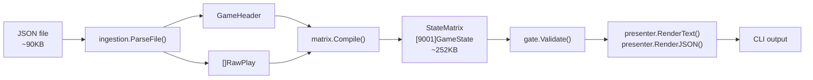
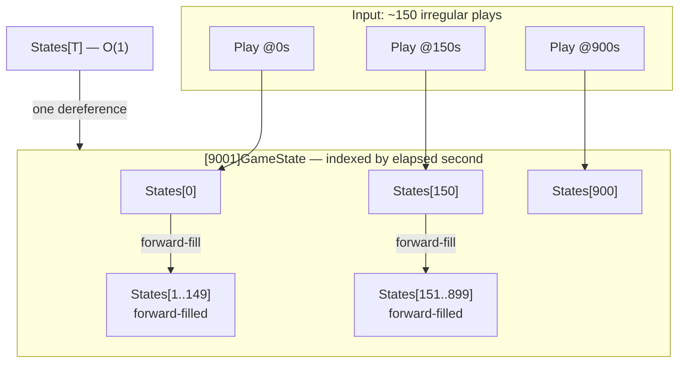
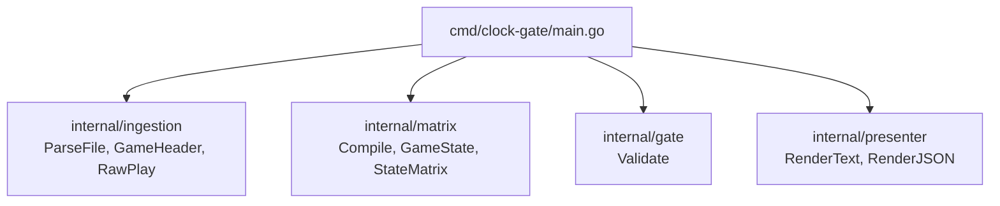
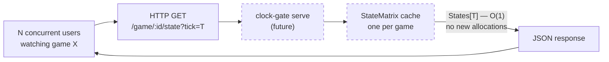

# clock-gate

Answer "what was the exact game state at elapsed second T?" for any NFL game in O(1) time, with a mathematical guarantee that no data from after tick T influences the result.

```
$ clock-gate --tick 1800 testdata/2011_01_NO_GB.json

┌────────────────────────────────────────────────────────────┐
│  NO @ GB   │  Q3  │  Elapsed: 1800s (30:00)            │
├────────────────────────────────────────────────────────────┤
│  Score:  GB 28  –  NO 17                                 │
│  Ball:   NO possession │  1st & 10  at NO 80             │
│  Win Prob: NO 15.3%                                        │
├────────────────────────────────────────────────────────────┤
│  (15:00) 28-M.Ingram up the middle to NO 21 for 1 yard (…│
└────────────────────────────────────────────────────────────┘
```

GB up 28–17 at the half, Rodgers and the defending Super Bowl champions would hold on 42–34.

---

## Prerequisites

- Go 1.26.3 or later (`go version` to check)

That's it. Three curated sample games ship with the repo in `testdata/` — no external data source required for development or demos.

> **Full dataset:** The broader ParadoxSportsData platform will handle data distribution for the full game library (current and historical seasons). `testdata/` is the development and demo path; production data loading is handled separately from this repo.

## Install

**Step 1 — Clone**

```bash
git clone https://github.com/ParadoxSportsData/paradox-clock-gate
cd paradox-clock-gate
```

**Step 2 — Build**

```bash
go build ./cmd/clock-gate/
```

No external dependencies. Binary produced at `./clock-gate`.

**Step 3 — Verify**

```bash
# Rodgers vs. the Saints, Week 1 2011 — halftime state
./clock-gate --tick 1800 testdata/2011_01_NO_GB.json
```

If you see a box-drawing table with score, quarter, and possession — setup is complete.

**Run tests**

```bash
go test ./...
go test -bench=BenchmarkQuery -benchmem ./internal/matrix/
```

---

## Sample games (`testdata/`)

| File | Game | Result |
|------|------|--------|
| `2011_01_NO_GB.json` | NO @ GB, Week 1 2011 | GB 42 – NO 34 |
| `2011_09_GB_SD.json` | GB @ SD, Week 9 2011 | GB 45 – SD 38 |
| `2011_14_OAK_GB.json` | OAK @ GB, Week 14 2011 | GB 46 – OAK 16 |

---

## Usage

```
clock-gate --tick <seconds> [--format text|json] <game-file>
clock-gate --list <directory>
```

| Flag | Description |
|------|-------------|
| `--tick` | Elapsed seconds since kickoff (required for queries) |
| `--format` | Output format: `text` (default) or `json` |
| `--list` | List all game files in a directory |

### Examples

```bash
# Kickoff
clock-gate --tick 0 testdata/2011_01_NO_GB.json

# Halftime (1800s = 30:00 elapsed)
clock-gate --tick 1800 testdata/2011_01_NO_GB.json

# Late game
clock-gate --tick 3500 testdata/2011_01_NO_GB.json

# JSON output, end of Q1
clock-gate --tick 900 --format json testdata/2011_01_NO_GB.json

# Query past game end — returns a bounded error
clock-gate --tick 999999 testdata/2011_01_NO_GB.json

# List available games
clock-gate --list testdata/

# Different game — road shootout at San Diego
clock-gate --tick 1800 testdata/2011_09_GB_SD.json
```

### Serve mode (HTTP API)

```bash
./clock-gate serve [--port <port>] [--data <dir>]
```

| Flag | Default | Description |
|------|---------|-------------|
| `--port` | `8080` | Port to listen on |
| `--data` | `./testdata` | Directory of game JSON files |

```bash
# Start with bundled testdata
./clock-gate serve

# Start with full 2011 dataset
./clock-gate serve --data ../paradox-platform/data/raw/
```

Endpoints served:

| Method | Path | Description |
|--------|------|-------------|
| `GET` | `/health` | Health check |
| `GET` | `/games` | List all games in the data directory |
| `GET` | `/games/{id}/timeline` | Play index (used by timeline scrubber) |
| `GET` | `/games/{id}/state?tick=T` | Game state at elapsed second T |

The `state` response shape is identical to CLI `--format json` output. All requests compile the game's StateMatrix on first access and serve subsequent queries in O(1) from the in-memory cache.

---

### JSON output

```json
{
  "elapsed": 900,
  "quarter": 2,
  "down": 1,
  "yards_to_go": 10,
  "yard_line": 62,
  "home_score": 21,
  "away_score": 7,
  "posteam": "NO",
  "defteam": "GB",
  "win_prob": 0.8355,
  "has_state": true,
  "play_description": "(15:00) 23-P.Thomas up the middle to NO 40 for 2 yards (90-B.Raji, 42-M.Burnett)."
}
```

`win_prob` is always the **home team's** win probability (0.0–1.0). The raw nflfastR `wp` field is possession-team WP; the compiler normalizes it at build time so all consumers receive a consistent home-team perspective regardless of who has the ball.

---

## Architecture

### The core idea

Each game file contains ~150–190 play events at irregular elapsed-second offsets. clock-gate compiles these into a pre-allocated flat array indexed directly by elapsed second — 9,001 slots covering regulation plus overtime. A query at tick T is `States[T]`: one array dereference, zero heap allocations, no branches.

### Temporal isolation guarantee

The forward-fill compiler iterates 0 → maxTick copying `States[t-1]` into any empty slot. Because the fill only copies earlier ticks forward, never later ticks backward, a query at tick T cannot contain any data from plays that happen after T. This is a structural guarantee, not a convention.

### System pipeline



### StateMatrix internals



### Package structure



### Serve mode — future state (Phase 2A)



One pre-compiled StateMatrix per game, shared across all concurrent users watching that game. O(1) query with no GC pressure on the hot path — the design scales to high concurrent read load without evolution.

---

## Performance

```
BenchmarkQuery-14    1000000000    0.2347 ns/op    0 B/op    0 allocs/op
```

Zero allocations on the query path. `GameState` contains no pointer fields (`[3]byte` for team abbreviations, `uint16`/`uint8` for all numeric fields) — the GC has nothing to collect at query time.

Memory per loaded game: ~252 KB for `[9001]GameState` + ~40–80 KB arena for play descriptions. Total: ~300–340 KB.

---

## Data format

Each game file is a JSON wrapper object:

```json
{
  "game_id": "2011_01_NO_GB",
  "home_team": "GB",
  "away_team": "NO",
  "home_score": 42,
  "away_score": 34,
  "plays": [ ... ]
}
```

Home/away teams are read from the JSON header fields — not from the filename. The parser uses token-mode `json.Decoder` to stream play objects one at a time without loading the full file into memory.

`game_clock_total_seconds` is the primary index field — pre-computed elapsed seconds since kickoff. Max observed value across 270 2011-season games: 4,500 (OT confirmed). `MaxTick = 9001` provides safe headroom.

---

## Design decisions

| Decision | Choice | Rationale |
|----------|--------|-----------|
| Language | Go | Assessment requirement; performance story is clean |
| CLI framework | `flag` stdlib | Zero deps; 3 flags don't warrant Cobra |
| Lookup | `[9001]GameState` flat array | O(1) with no runtime conditionals; 252 KB is trivial |
| Runtime allocations | Zero after init | Arena allocator; `[3]byte` teams; no pointers in hot struct |
| WinProb | `uint16` (× 10000) | GC-free struct; 0.01% precision sufficient |
| Team abbreviations | `[3]byte` | Eliminates GC-visible pointer |
| Description storage | Arena + offset/length | One alloc at compile time |
| Phase 2A backend | `net/http` stdlib | Same zero-dep rationale as `flag` |

---

## Testing

```bash
# All tests
go test ./...

# Critical benchmark — must show 0 allocs/op
go test -bench=BenchmarkQuery -benchmem ./internal/matrix/

# Vet
go vet ./...
```

Every package has tests written before implementation (TDD). The pre-commit hook enforces `go test ./...` before any commit.

---

## Known rough edges

- `--tick` requires raw elapsed seconds; `--clock "Q2 15:00"` would be better UX
- `--list` returns filenames only — no play counts or final scores
- No `--range T1 T2` for interval diff
- `HasState = false` for ticks before the first play — callers must check; the type system doesn't enforce it

See `WRITEUP.md` for the full engineering discussion.
