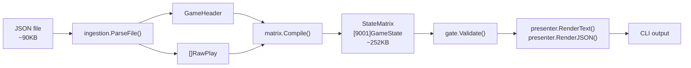
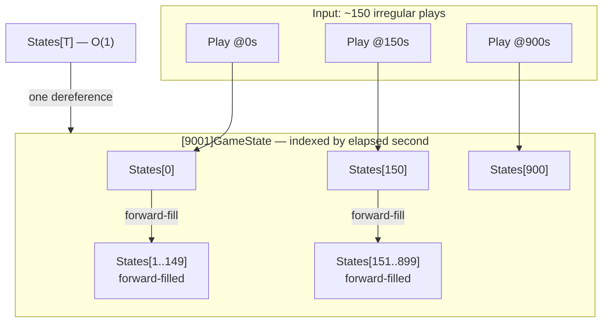
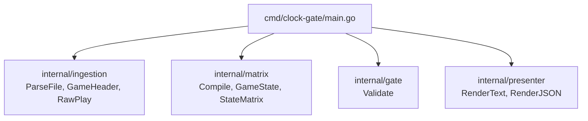
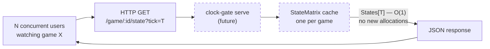

# clock-gate

Answer "what was the exact game state at elapsed second T?" for any NFL game in O(1) time, with a mathematical guarantee that no data from after tick T influences the result.

```
$ clock-gate --tick 1800 data/raw/2011_01_ATL_CHI.json

┌────────────────────────────────────────────────────────────┐
│  ATL @ CHI   │  Q3  │  Elapsed: 1800s (30:00)          │
├────────────────────────────────────────────────────────────┤
│  Score:  CHI 16  –  ATL 3                                │
│  Ball:   ATL possession                                    │
│  Win Prob: ATL 11.2%                                       │
├────────────────────────────────────────────────────────────┤
│  9-R.Gould kicks 66 yards from CHI 35 to ATL -1. 14-E.We…│
└────────────────────────────────────────────────────────────┘
```

---

## Install

```bash
git clone https://github.com/ParadoxSportsData/paradox-clock-gate
cd paradox-clock-gate
go build ./cmd/clock-gate/
```

No external dependencies. Requires Go 1.21+.

---

## Usage

```
clock-gate --tick <seconds> [--format text|json] <game-file>
clock-gate --list <directory>
```

| Flag | Description |
|------|-------------|
| `--tick` | Elapsed seconds since kickoff (required for queries) |
| `--format` | Output format: `text` (default) or `json` |
| `--list` | List all game files in a directory |

### Examples

```bash
# Kickoff
clock-gate --tick 0 data/raw/2011_01_ATL_CHI.json

# Halftime (1800s = 30:00 elapsed)
clock-gate --tick 1800 data/raw/2011_01_ATL_CHI.json

# Late game, JSON output
clock-gate --tick 3500 --format json data/raw/2011_01_ATL_CHI.json

# Query past game end — returns a bounded error
clock-gate --tick 999999 data/raw/2011_01_ATL_CHI.json

# List available games
clock-gate --list data/raw/
```

### JSON output

```json
{
  "elapsed": 900,
  "quarter": 2,
  "down": 3,
  "yards_to_go": 8,
  "yard_line": 58,
  "home_score": 10,
  "away_score": 3,
  "posteam": "CHI",
  "defteam": "ATL",
  "win_prob": 0.7308,
  "has_state": true,
  "play_description": "(15:00) 6-J.Cutler sacked at CHI 39 for -3 yards (55-J.Abraham)."
}
```

---

## Architecture

### The core idea

Each game file contains ~120–150 play events at irregular elapsed-second offsets. clock-gate compiles these into a pre-allocated flat array indexed directly by elapsed second — 9,001 slots covering regulation plus overtime. A query at tick T is `States[T]`: one array dereference, zero heap allocations, no branches.

### Temporal isolation guarantee

The forward-fill compiler iterates 0 → maxTick copying `States[t-1]` into any empty slot. Because the fill only copies earlier ticks forward, never later ticks backward, a query at tick T cannot contain any data from plays that happen after T. This is a structural guarantee, not a convention.

### System pipeline



### StateMatrix internals



### Package structure



### Serve mode — future state (Phase 2A)



One pre-compiled StateMatrix per game, shared across all concurrent users watching that game. O(1) query with no GC pressure on the hot path — the design scales to high concurrent read load without evolution.

---

## Performance

```
BenchmarkQuery-14    1000000000    0.24 ns/op    0 B/op    0 allocs/op
```

Zero allocations on the query path. `GameState` contains no pointer fields (`[3]byte` for team abbreviations, `uint16`/`uint8` for all numeric fields) — the GC has nothing to collect at query time.

Memory per loaded game: ~252 KB for `[9001]GameState` + ~40–80 KB arena for play descriptions. Total: ~300–340 KB.

---

## Data format

Each game file is a JSON wrapper object:

```json
{
  "game_id": "2011_01_ATL_CHI",
  "home_team": "CHI",
  "away_team": "ATL",
  "home_score": 30,
  "away_score": 12,
  "plays": [ ... ]
}
```

Home/away teams are read from the JSON header fields — not from the filename. The parser uses token-mode `json.Decoder` to stream play objects one at a time without loading the full file into memory.

`game_clock_total_seconds` is the primary index field — pre-computed elapsed seconds since kickoff. Max observed value across 270 2011-season games: 4,500 (OT confirmed). `MaxTick = 9001` provides safe headroom.

---

## Design decisions

| Decision | Choice | Rationale |
|----------|--------|-----------|
| Language | Go | Assessment requirement; performance story is clean |
| CLI framework | `flag` stdlib | Zero deps; 3 flags don't warrant Cobra |
| Lookup | `[9001]GameState` flat array | O(1) with no runtime conditionals; 252 KB is trivial |
| Runtime allocations | Zero after init | Arena allocator; `[3]byte` teams; no pointers in hot struct |
| WinProb | `uint16` (× 10000) | GC-free struct; 0.01% precision sufficient |
| Team abbreviations | `[3]byte` | Eliminates GC-visible pointer |
| Description storage | Arena + offset/length | One alloc at compile time |
| Phase 2A backend | `net/http` stdlib | Same zero-dep rationale as `flag` |

---

## Testing

```bash
# All tests
go test ./...

# Critical benchmark — must show 0 allocs/op
go test -bench=BenchmarkQuery -benchmem ./internal/matrix/

# Vet
go vet ./...
```

Every package has tests written before implementation (TDD). The pre-commit hook enforces `go test ./...` before any commit.

---

## Known rough edges

- `--tick` requires raw elapsed seconds; `--clock "Q2 15:00"` would be better UX
- `--list` returns filenames only — no play counts or final scores
- No `--range T1 T2` for interval diff
- `HasState = false` for ticks before the first play — callers must check; the type system doesn't enforce it

See `WRITEUP.md` for the full engineering discussion.
